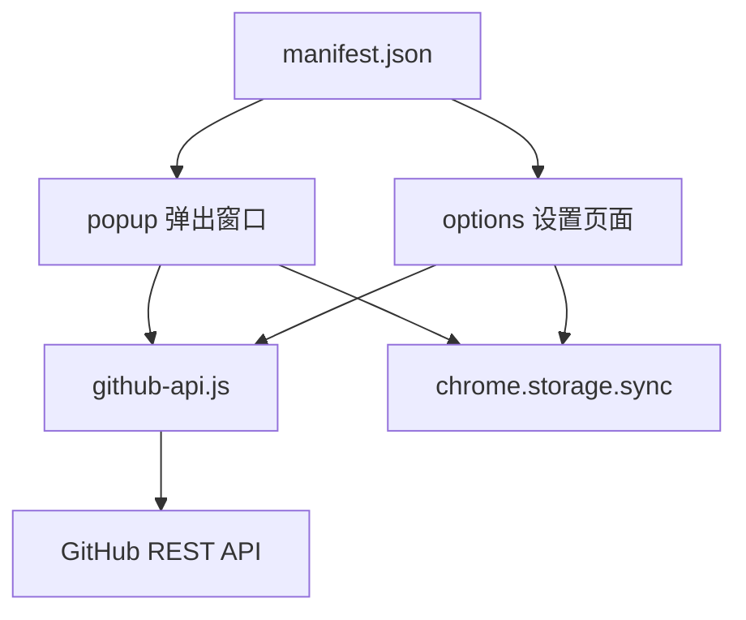

# Clash 规则管理器

> **最后更新**: 2026-01-26 14:23:54

## 项目概览

Chrome/Edge 浏览器扩展，用于快速将当前访问的域名添加到 GitHub 仓库的 Clash 规则文件中。

**技术栈**: Manifest V3 | 原生 JavaScript | GitHub REST API

## 项目结构



## 核心模块

### 📦 popup - 弹出窗口模块
**路径**: `popup.html`, `popup.js`, `popup.css`

- 提取当前标签页域名（支持根域名提取和特殊 TLD）
- 渲染规则分组按钮（直连/代理/自定义）
- 调用 GitHub API 添加域名到规则文件
- Toast 提示反馈

**关键函数**:
- `extractRootDomain()` - popup.js:18 - 提取根域名逻辑
- `addDomainToGroup()` - popup.js:121 - 添加域名到规则文件

### ⚙️ options - 设置页面模块
**路径**: `options.html`, `options.js`, `options.css`

- GitHub Token/仓库配置管理
- 规则分组配置（支持多分组）
- 连接测试功能
- 配置导入/导出

**关键函数**:
- `saveSettings()` - options.js:122 - 保存配置到 chrome.storage.sync
- `testConnection()` - options.js:169 - 测试 GitHub API 连接

### 🔌 github-api - GitHub API 交互模块
**路径**: `github-api.js`

封装 GitHub REST API 调用，处理文件读取、更新和域名添加。

**核心类**: `GitHubAPI`
- `getFileContent()` - github-api.js:13 - 获取文件内容（Base64 解码）
- `updateFile()` - github-api.js:43 - 更新文件内容（Base64 编码）
- `addDomainToFile()` - github-api.js:79 - 添加域名到规则文件（DOMAIN-SUFFIX 格式）

## 数据流

```
用户点击按钮
  ↓
popup.js 提取域名
  ↓
GitHubAPI.addDomainToFile()
  ↓
getFileContent() → 检查重复 → updateFile()
  ↓
GitHub API (PUT /repos/:owner/:repo/contents/:path)
  ↓
Toast 反馈结果
```

## 配置存储

使用 `chrome.storage.sync` 存储配置：

```javascript
{
  token: string,        // GitHub Personal Access Token
  owner: string,        // 仓库所有者
  repo: string,         // 仓库名称
  branch: string,       // 分支名称（默认 main）
  ruleGroups: [         // 规则分组配置
    { name: string, path: string, type?: string }
  ]
}
```

## 权限说明

- `activeTab` - 获取当前标签页 URL
- `storage` - 存储配置信息
- `tabs` - 查询标签页信息
- `https://api.github.com/*` - 调用 GitHub API

## 开发指南

### 本地调试

1. 访问 `chrome://extensions/`
2. 开启"开发者模式"
3. 点击"加载已解压的扩展程序"
4. 选择项目根目录
5. 修改代码后点击"重新加载"

### 规则格式

Clash 规则格式：`DOMAIN-SUFFIX,example.com`

### 域名提取逻辑

- 支持特殊多级 TLD（co.uk, com.cn 等）
- 自动提取根域名（去除子域名前缀）
- 支持 IP 地址和 localhost

## 文件清单

```
clash-rule-manager/
├── manifest.json           # Manifest V3 配置
├── popup.html/js/css       # 弹出窗口（195 行）
├── options.html/js/css     # 设置页面（260 行）
├── github-api.js           # GitHub API 模块（115 行）
├── icons/                  # 扩展图标
│   ├── icon16.png
│   ├── icon48.png
│   └── icon128.png
└── README.md               # 用户文档
```

**统计**: 8 个核心文件 | ~570 行代码

## 安全考虑

- Token 存储在 chrome.storage.sync（浏览器加密）
- 所有 API 调用使用 HTTPS
- Token 仅发送到 GitHub API
- 建议定期更换 Token

## 常见问题

- **Token 无效**: 检查权限是否包含 `repo`
- **文件不存在**: 需在 GitHub 仓库中预先创建规则文件
- **域名已存在**: 规则文件中已包含该域名
- **权限不足**: 检查 Token 是否有仓库写入权限
